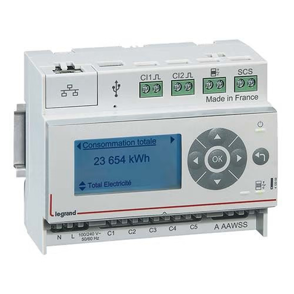

# Legrand Ecocompteur Integration

[![GitHub Release][releases-shield]][releases]
[![GitHub Activity][commits-shield]][commits]
[![License][license-shield]](LICENSE)
![Project Maintenance][maintenance-shield]

[![Discord][discord-shield]][discord]
[![Community Forum][forum-shield]][forum]

_Home Assistant integration for [Legrand Ecocompteur (412000)][ecocompteur] energy monitoring device._

## Features

- **Multi-device support**: Configure multiple Ecocompteur devices on the same Home Assistant instance
- **Energy monitoring**: Track electricity consumption via TIC (Télé-Information Client) sensors
- **Real-time power**: Monitor instantaneous power consumption across 5+ circuits
- **Circuit monitoring**: Individual power tracking for different electrical circuits (heating, water heater, appliances, etc.)
- **Water/Gas metering**: Support for additional pulse counters (water, gas, etc.)
- **Local polling**: Direct communication with your device over local network

### Sensors

This integration creates the following sensor types:

- **TIC Sensors** (Energy): Base, HC (off-peak), HP (peak), and tariff variants (Blue/White/Red)
- **Power Sensors**: Real-time power consumption for 5 configurable circuits
- **Pulse Counter Sensors**: Energy tracking for circuits 1-4 and additional utilities

## Requirements

- Home Assistant 2024.10.0 or newer
- Legrand Ecocompteur (412000) device on your local network
- Network connectivity between Home Assistant and your Ecocompteur

## Installation

### HACS (Recommended)

1. Open HACS in your Home Assistant instance
2. Click on "Integrations"
3. Click the three dots in the top right corner
4. Select "Custom repositories"
5. Add this repository URL: `https://github.com/AlexandreFournier/ha-ecocompteur`
6. Select category: "Integration"
7. Click "Add"
8. Search for "Legrand Ecocompteur" in HACS
9. Click "Download"
10. Restart Home Assistant

### Manual Installation

1. Download the `custom_components/ecocompteur/` directory from this repository
2. Copy it to your Home Assistant's `custom_components` directory
3. Restart Home Assistant

## Configuration

Configuration is done entirely through the Home Assistant UI:

1. Go to **Settings** → **Devices & Services**
2. Click **+ Add Integration**
3. Search for **Legrand Ecocompteur**
4. Enter your device configuration:
   - **Name** (optional): Custom name for this device
   - **Host**: IP address of your Ecocompteur device
5. Click **Submit**

### Adding Multiple Devices

You can add multiple Ecocompteur devices by repeating the configuration steps above with different IP addresses. Each device will be tracked separately with its own unique identifier.

## Development & Testing

A Docker-based simulator is available for testing without physical hardware. See [simulator/README.md](simulator/README.md) for details.

## Troubleshooting

**Integration shows "cannot_connect" error:**
- Verify the IP address is correct
- Ensure the Ecocompteur is powered on and accessible on your network
- Check that no firewall is blocking communication
- Try accessing `http://<ecocompteur-ip>/data.json` in a browser

**Sensors showing unavailable:**
- Check the integration logs for connection errors
- Verify network connectivity hasn't changed
- Restart the integration from Settings → Devices & Services

## Contributions

Contributions are welcome! Please read the [Contribution guidelines](CONTRIBUTING.md) before submitting a pull request.

***

[ecocompteur]: https://github.com/AlexandreFournier/ha-ecocompteur
[commits-shield]: https://img.shields.io/github/commit-activity/y/AlexandreFournier/ha-ecocompteur.svg?style=for-the-badge
[commits]: https://github.com/AlexandreFournier/ha-ecocompteur/commits/main
[discord]: https://discord.gg/Qa5fW2R
[discord-shield]: https://img.shields.io/discord/330944238910963714.svg?style=for-the-badge
[forum-shield]: https://img.shields.io/badge/community-forum-brightgreen.svg?style=for-the-badge
[forum]: https://community.home-assistant.io/
[license-shield]: https://img.shields.io/github/license/AlexandreFournier/ha-ecocompteur.svg?style=for-the-badge
[maintenance-shield]: https://img.shields.io/badge/maintainer-%40AlexandreFournier-blue.svg?style=for-the-badge
[releases-shield]: https://img.shields.io/github/release/AlexandreFournier/ha-ecocompteur.svg?style=for-the-badge
[releases]: https://github.com/AlexandreFournier/ha-ecocompteur/releases
